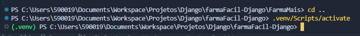

# Projeto FarmaFácil com Django

Este é o repositório da aplicação FarmaFácil, desenvolvida inteiramente com o framework Django, do Python.

Para o funcionamento do projeto, é necessária a instalação de algumas dependências.

## 1. Python

Primeiramente, verifique se o Python se encontra instalado em sua máquina.

Use este comando em um terminal (cmd) para fazer a verificação:

    python --version

 

Caso ele esteja instalado, prossiga para o passo 2.
Caso contrário, acesse [o site do python](python.org) e instale-o.

## 2. pip

O pip é o gerenciador de pacotes do Python. Precisaremos dele para instalar o Django.
Geralmente, o pip já vem em conjunto do Python em sua instalação, mas, caso você queira sanar suas dúvidas, ou verificar se você está na última versão, use este comando em um terminal:

    pip --version

 

## 3. Django

Este é o fundamental para o funcionamento do projeto.
Django é uma framework do Python que cria, de forma automática, uma boa parte do back-end de uma aplicação web.

Ele não vem junto do Python. Deve ser instalado com este comando:

    pip install django

## 4. venv

Venv é uma máquina virtual do Python.
Quando estamos desenvolvendo em python, existe a possibilidade de instalar dezenas de bibliotecas no nosso computador, e algumas podem ter conflitos entre elas mesmas devido a dependências, versões, entre outros motivos.

Por isso, foi criada a venv, Virtual Environment.
A venv é como um repositório temporário para a instalação de várias bibliotecas.
Quando instaladas dentro da venv, elas não serão colocadas diretamente no seu sistema operacional, e, assim, não causarão conflitos com outros projetos.

Crie uma venv usando este comando:

    python -m venv nome_da_venv

 

Em seguida, você notará a criação de uma pasta com o nome que você informou no comando.

#### Ativando a venv:
Para fazer com que a venv abrigue suas bibliotecas, utilize este comando:

    nome_da_venv/Scripts/activate

 

Você notará uma mudança no caminho do terminal.
Abaixo, um exemplo de como identificar que a venv foi ativada:

Para desativar a venv, use o comando abaixo:

    deactivate

Agora, clone este repositório GIT no mesmo diretório que você salvou sua venv.

A estrutura deve ficar assim:

    nome_da_sua_venv/
     
    FarmaMais/
     
    

        FarmaMais/
         
        FarmaApp/
    

 
Caminhe até a pasta FarmaMais com 

cd FarmaMais

 
 

Quando estiver dentro dela, insira o comando abaixo:

    python manage.py runserver

 
Pronto, seu servidor Django está rodando na porta 80000, mais especificamente no endereço 

[http://127.0.0.1:8000](http://127.0.0.1:8000)

## Django admin

Como dito anteriormente, o Django cria uma boa parte do sistema de gerenciamento da aplicação.

É possível acessar o SGBD nativo do Django acessando a rota 'admin/'. Porém, antes, temos que criar um superuser dentro do django, que é um usuário administrador do sistema.

Use o comando abaixo e siga as instruções do console para registrar um superuser:

    python manage.py createsuperuser

 

## Rotas

Atualmente, o sistema conta com as seguintes rotas:

+ '/' - Rota padrão.
+ 'cadastro/' - Rota de cadastro do usuário
+ 'cadastroFarmacia/' - Rota de cadastro da farmácia
+ 'login/' - Rota de login do usuário
+ 'admin/' - Rota de administração do banco.

Para mais informações sobre o Django, consulte as outras fontes:

+ [W3Schools - Django](https://www.w3schools.com/Django);
+ [Django Documentation (official)](https://docs.djangoproject.com/en/5.0/);
+ [Read the Docs - Django](https://django.readthedocs.io/en/stable/contents.html)
